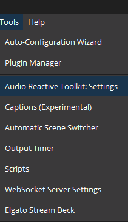
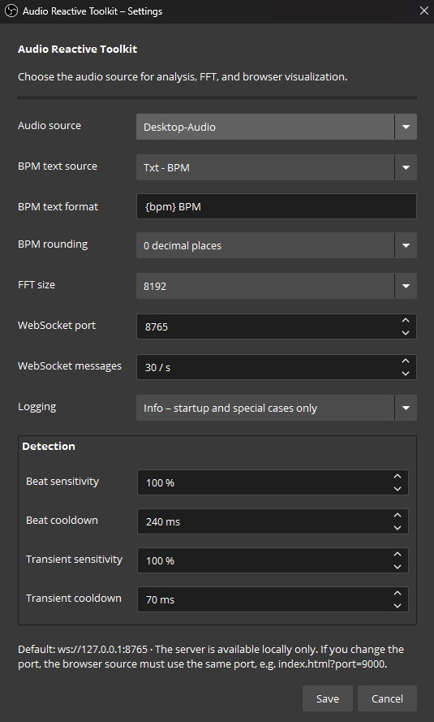

# Audio Reactive Toolkit Help

This guide covers installation, initial setup, browser visualizers, troubleshooting, and removal of Audio Reactive
Toolkit (ART). The plugin is currently in early access, so settings and the local WebSocket message format may change
before version 1.0.

## Supported systems

- Windows 10 or 11, x64
- macOS 12 or later, Intel or Apple Silicon
- Ubuntu 24.04, x86_64
- OBS Studio 31.1.1 or later

Windows and Linux have received the primary runtime testing for this release. 
macOS packages build successfully but are not yet runtime-tested; please report platform-specific problems.

## Download

Download the latest package from the
[GitHub Releases page](https://github.com/Funkrusha/audio-reactive-toolkit/releases).

For `0.2.0`, choose the package for your system:

- Windows: `windows-x64-setup.exe`
- macOS: `macos-universal.pkg`
- Ubuntu: `x86_64-linux-gnu.deb`

Debug-symbol packages and archives ending in `dSYMs.tar.xz` or `dbgsym.ddeb` are intended for diagnosing crashes and
are not required for normal use.

## Install

Close OBS Studio before installing or updating the plugin.

### Windows

Run the downloaded `windows-x64-setup.exe`, confirm the OBS Studio installation directory, and complete the installer.
The portable ZIP contains the same plugin files for manual installation.

### macOS

Open the downloaded `macos-universal.pkg` and follow the installer. The plugin is installed for OBS Studio under the
system Library application-support directory. If macOS blocks the package, open **System Settings > Privacy &
Security** and review the displayed security message before trying again.

### Ubuntu

Install the downloaded package from a terminal:

```bash
sudo apt install ./audio-reactive-toolkit-0.2.0-x86_64-linux-gnu.deb
```

Using `apt` instead of `dpkg` allows required dependencies to be resolved automatically.

## Initial setup

1. Start OBS Studio.
2. Open **Tools > Audio Reactive Toolkit: Settings**.

   

3. Select the OBS audio source that should drive the analysis. **Automatic** uses the first global audio output.
4. Keep the WebSocket port at `8765` unless it conflicts with another local service.
5. Save the settings.
6. Add one of the included visualizers as an OBS Browser Source.

Settings are persisted by OBS and restored the next time it starts.

<p align="center">
  
</p>

## Add a visualizer

Create an OBS **Browser** source, enable **Local file**, and select an HTML file from the plugin's `browser` directory.

Common installation locations are:

- Windows: `C:\Program Files\obs-studio\data\obs-plugins\audio-reactive-toolkit\browser`
- macOS: `/Library/Application Support/obs-studio/plugins/audio-reactive-toolkit.plugin/Contents/Resources/browser`
- Ubuntu: `/usr/share/obs/obs-plugins/audio-reactive-toolkit/browser`

Available pages:

- `index.html`: diagnostic view with levels, spectrum, events, and BPM
- `visualizer-three.html`: transparent Three.js orb
- `visualizer-tunnel.html`: neon tunnel
- `visualizer-landscape.html`: spectrum landscape
- `visualizer-vortex.html`: neon particle vortex with beat shockwaves
- `visualizer-aurora.html`: flowing liquid aurora curtains
- `visualizer-city.html`: futuristic spectrum-driven skyline
- `visualizer-constellation.html`: connected audio-reactive star field
- `visualizer-vectorscope.html`: XY energy scope using bass and mid frequencies

Use `1280 x 720` for the artistic visualizers. The diagnostic view works well at `1280 x 1280`.

### Custom WebSocket port

If the plugin uses a port other than `8765`, append it to the Browser Source URL:

```text
visualizer-three.html?port=9000
```

The plugin setting and Browser Source parameter must use the same port.

The vectorscope uses bass on the X axis and mids on the Y axis by default. Use
`visualizer-vectorscope.html?axes=bass-high` to place high frequencies on the Y axis instead. This visualization maps
band energy over time; it is not a phase-accurate oscilloscope of the raw PCM waveform.

For custom visualizers and integrations, see the [WebSocket protocol reference](WEBSOCKET.md).

### Spectrum display scaling

The visualizers support these optional URL parameters:

```text
?scale=linear
?scale=perceptual
?scale=db&floor=-70
```

`perceptual` is recommended for music. Parameters can be combined, for example:

```text
visualizer-landscape.html?port=8765&scale=perceptual
```

## Show BPM in an OBS text source

1. Create an OBS **Text (GDI+)** source.
2. Open the plugin settings.
3. Select the source under **BPM text source**.
4. Enter a format containing `{bpm}`, such as `Tempo: {bpm}`.
5. Select the desired rounding and save.

Font, color, outline, position, and other styling remain controlled by OBS. Select **None** to disable native BPM text
output.

## Troubleshooting

### The plugin does not appear in the Tools menu

- Fully close and restart OBS after installation.
- Confirm that a 64-bit package was installed into the same OBS installation that you started.
- Update OBS to a supported version.
- In OBS, open **Help > Log Files > View Current Log** and search for `audio-reactive-toolkit`.

### The Browser Source says it is disconnected

- Confirm that OBS and the plugin are running.
- Confirm that the Browser Source and plugin use the same WebSocket port.
- Restore the default port `8765` to rule out a configuration error.
- Check whether another application is already using the selected port.
- Refresh the Browser Source after changing the port or restarting the plugin.

The WebSocket server listens only on `127.0.0.1`; it is not exposed to other computers on the network.

### The visualizer connects but does not react

- Select an active OBS audio source in the plugin settings.
- Verify that the source's audio meter moves in OBS.
- Try the diagnostic `index.html` page to inspect levels and spectrum data.
- Temporarily restore the default FFT and detection settings.

### BPM is missing or unstable

BPM estimation needs a sufficiently regular beat and a short observation period. Try music with a clear rhythm, allow
the estimator time to lock, and use the diagnostic view to check confidence. Ambient audio, speech, tempo changes, and
weak percussion may not produce a stable result.

### Getting a useful log

Set **Logging** to **Debug** in the plugin settings, reproduce the problem briefly, then use **Help > Log Files > Upload
Current Log File** in OBS. Disable debug logging again afterward because it produces continuous diagnostic output.

## Update or remove

Close OBS before updating or removing the plugin.

- Windows: run a newer installer to update, or remove **Audio Reactive Toolkit** from Windows installed apps.
- macOS: install a newer package to update. To remove it manually, delete
  `/Library/Application Support/obs-studio/plugins/audio-reactive-toolkit.plugin`.
- Ubuntu: update by installing the newer `.deb`, or remove the plugin with
  `sudo apt remove audio-reactive-toolkit`.

Existing OBS scenes and Browser Sources are not deleted when the plugin is removed.

## Report a problem

Use [GitHub Issues](https://github.com/Funkrusha/audio-reactive-toolkit/issues) and include:

- plugin version;
- OBS version;
- operating system and architecture;
- installation package used;
- steps to reproduce the problem;
- expected and actual behavior;
- an OBS log, when relevant.

Before posting a log publicly, review it for information you do not want to share.
